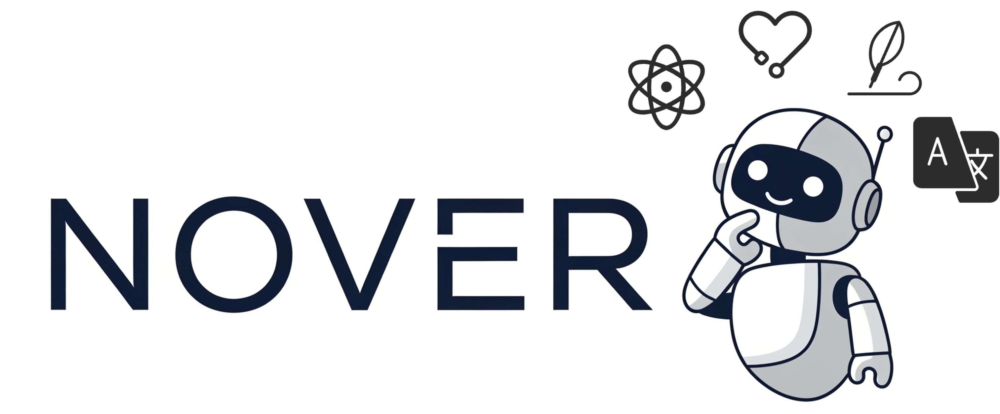

<div align="center">
  
</div>

# NOVER: Incentive Training for Language Models via Verifier-Free Reinforcement Learning

This is the official implementation of the paper ["NOVER: Incentive Training for Language Models via Verifier-Free Reinforcement Learning"](https://www.arxiv.org/pdf/2505.16022).

## Overview

NOVER is a novel reinforcement learning approach for training language models without requiring explicit verifiers. The method can perform DeepSeek R1-Zero-like training on any SFT data, extending reasoning abilities beyond math and coding to fields such as translation, scientific reasoning, creative writing, social reasoning, and more.

## Installation

1. Clone this repository
```bash
git clone https://github.com/thinkwee/NOVER.git
cd NOVER
```

2. Install dependencies
```bash
pip install -r requirements.txt
```

## Configuration

Before training, you need to modify the configuration settings in `config.py`. We recommend using [Qwen/Qwen2.5-7B](https://huggingface.co/Qwen/Qwen2.5-7B).
The key parameters to update include:

- **Project identification**:
  - `SUFFIX`: A unique identifier for your training run
  - `WANDB_PROJECT`: Your Weights & Biases project name
  - `HF_HOME`: Your huggingface root path for loading models and datasets
  - `DATASET_NAME`: Your dataset name under `HF_HOME`

- **Model settings**:
  - `MODEL_NAME_VLLM`: Model to use for VLLM server (e.g., "Qwen/Qwen2.5-7B")
  - `MODEL_NAME`: Model to use for training (usually same as VLLM model)
  - `SAVE_BASE_PATH`: Directory to save model checkpoints

## Training Process

### Step 1: Prepare Your Data
- Format your data as a standard Hugging Face Arrow dataset with at least two columns: `prompt` and `reference`, representing input and output in any standard SFT dataset. No conversational format or system prompts are required.
- Structure your input data in the `prompt` column as follows:
```markdown
Question: {input}

Answer the question and return in the following format:

<think>
...
</think>

<answer>
...
</answer>
```

### Step 1: Weights & Biases Setup

Set up your Weights & Biases credentials:

```bash
export WANDB_API_KEY=your_api_key
export WANDB_ENTITY=your_entity
```

### Step 2: Start the VLLM Server

First, start the VLLM server for model rollouts:

```bash
sh run_vllm_server.sh
```

This will launch a VLLM server using the model specified in `MODEL_NAME_VLLM` and the port specified in `VLLM_PORT`.

### Step 3: Start Training

After the VLLM server is running, start the training process:

```bash
sh run_training.sh
```

This will begin the training process using the configuration parameters defined in `config.py`.

## Model Generation

The model is trained with Hugging Face PEFT and saved in the standard LoRA adapter format. To use the trained model:

1. Load the adapter and merge it with the base model:

```python
from peft import PeftModel
from transformers import AutoModelForCausalLM

base_model = AutoModelForCausalLM.from_pretrained(base_model_path)
model = PeftModel.from_pretrained(base_model, adapter_path)
merged_model = model.merge_and_unload()

model.save_pretrained(
    merge_output_dir,
    safe_serialization=True)

tokenizer = AutoTokenizer.from_pretrained(base_model_path)
tokenizer.save_pretrained(merge_output_dir)
```

2. Use the vllm to serve the merged model in ```merge_output_dir```.

## Citation

If you find this work useful, please cite our paper:

```bibtex
@article{liu2025noverincentivetraininglanguage,
      title={NOVER: Incentive Training for Language Models via Verifier-Free Reinforcement Learning}, 
      author={Wei Liu and Siya Qi and Xinyu Wang and Chen Qian and Yali Du and Yulan He},
      year={2025},
      eprint={2505.16022},
      archivePrefix={arXiv},
      primaryClass={cs.CL},
      url={https://arxiv.org/abs/2505.16022}, 
}
```

## Todo
- [x] init for training code
- [ ] cleaned NOVER data
- [ ] support easier SFT data import
- [ ] support inverse incentive training
- [ ] support incentive steering
